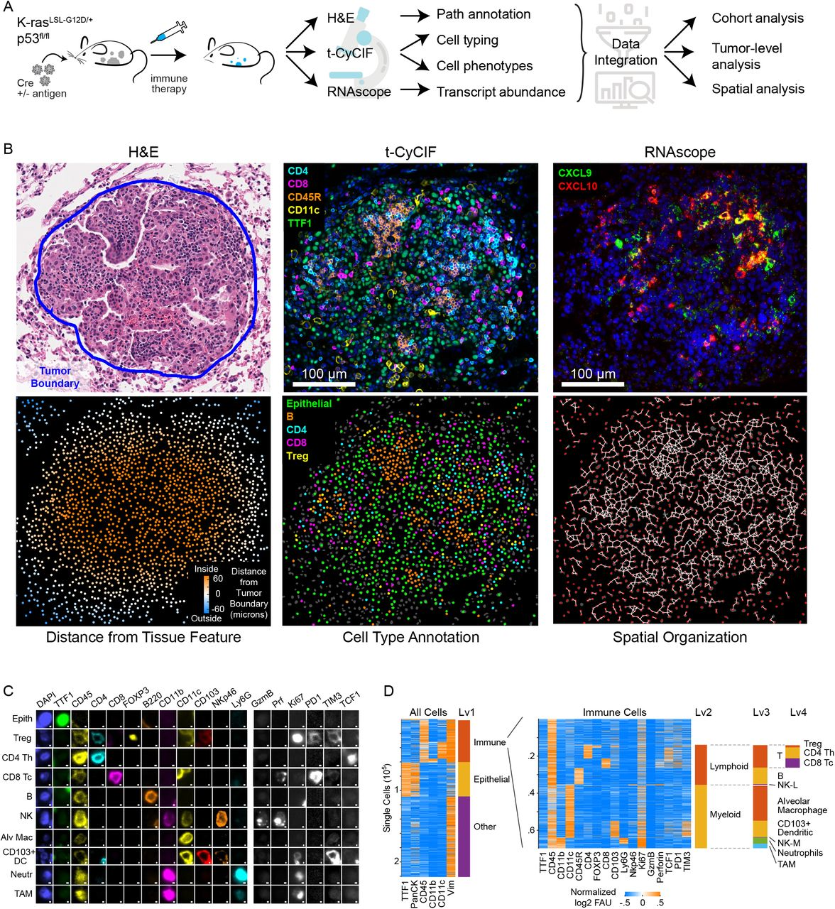

# Lymphocyte networks are dynamic cellular communities in the immunoregulatory landscape of lung adenocarcinoma
 
Giorgio Gaglia*, Megan L. Burger*, Cecily C. Ritch, Danae Rammos, Yang Dai, Grace E. Crossland, Sara Z. Tavana, Simon Warchol, Alex M. Jaeger, Santiago Naranjo, Shannon Coy, Ajit J. Nirmal1, Robert Krueger, Jia-Ren Lin, Hanspeter Pfister, Peter K. Sorger†, Tyler Jacks†, Sandro Santagata†
 
 
*These authors contributed equally 
†Equal contribution, Senior authors 
 
Lead contact: Sandro Santagata, ssantagata@bics.bwh.harvard.edu  
 

 

## SUMMARY

 
Lymphocytes are key to immune surveillance of tumors, but our understanding of the spatial organization and physical interactions that facilitate lymphocyte anti-cancer functions is limited. Here, we used multiplexed imaging, quantitative spatial analysis, and machine learning to create high-definition maps of tumor-bearing lung tissues from a Kras/p53 mouse model and human resections. Networks of interacting lymphocytes (‘lymphonets’) emerged as a distinctive feature of the anti-cancer immune response. Lymphonets nucleated from small T-cell clusters and incorporated B cells with increasing size. CXCR3-mediated trafficking modulated lymphonet size and number, but T-cell antigen expression directed intratumoral localization. Lymphonets preferentially harbored TCF1+PD1+ progenitor CD8 T cells involved in responses to immune checkpoint blockade (ICB) therapy. Upon treatment of mice with ICB or an antigen-targeted vaccine, lymphonets retained progenitor and gained cytotoxic CD8 T-cell populations, likely via progenitor differentiation. These data show that lymphonets create a spatial environment supportive of CD8 T-cell anti-tumor responses.
 

## View image data online
Some data is available as narrated data explorations (with text and audio narration) for anonymous on-line browsing using MINERVA software (Rashid et al., 2022), which allows users to pan and zoom through the images without requiring any software installation. 

**To view the Minerva stories, please visit [https://tinyurl.com/mouseprofiling](https://tinyurl.com/mouseprofiling).**  

## Codes for imaging data processing

High-plex whole-slide images were acquired using tissue cyclic immunofluorescence (t-CyCIF; Lin et al, 2018) and then stitched and registered using ASHLAR (https://github.com/labsyspharm/ashlar). For single cell segmentation, a random forest classifier was trained in Ilastik (https://www.ilastik.org/download.html) to generate probability maps of the following classes: Background, Cytoplasm, Nuclei. Watershedding was performed in Matlab on these maps to segment individual nuclei, and single cell features were extracted with Matlab's regionprops function (See Image_processing_scripts). 

Downstream analysis was performed on the single cell data using custom Matlab scripts. For each dataset, single cell data was aggregated from each sample, filtered based on quality of segmentation, and then assigned to cell types in a hierarchical manner based on single cell protein expression data. To perform lymphocyte network (Lymphonet) analysis, neighborhood graphs were computed on centroid data and pruned based on edge weight and cell identity (See Data_analysis_scripts).  

## Data availability
All summary data is located on Synapse.org in the following repository and organized by individual datasets: 
https://www.synapse.org/#!Synapse:syn30715952/wiki/617734. 

Results were saved as .mat files and include single cell data that summarize IF expression, cell morphology, and spatial features. 

Single cell tables, codes, and meta data are organized by each experimental dataset using the following folder hierarchy: 
 
 
|---&nbsp;Lung_Data
 
|&nbsp;&nbsp;&nbsp;&nbsp;&nbsp;|--- Dataset01-KP_LucOS_CXCL10_CyCIF
 
|&nbsp;&nbsp;&nbsp;&nbsp;&nbsp;|&nbsp;&nbsp;&nbsp;&nbsp;&nbsp;|---CyCIF_Experimental_Panel
 
|&nbsp;&nbsp;&nbsp;&nbsp;&nbsp;|&nbsp;&nbsp;&nbsp;&nbsp;&nbsp;|---MetaData
 
|&nbsp;&nbsp;&nbsp;&nbsp;&nbsp;|&nbsp;&nbsp;&nbsp;&nbsp;&nbsp;|---Quantification
 
|&nbsp;&nbsp;&nbsp;&nbsp;&nbsp;|--- Dataset02-KP_LucOS_CXCL10_RNAScope  
|&nbsp;&nbsp;&nbsp;&nbsp;&nbsp;|--- Dataset03-KP_LucOS_anti_PD1_CTLA4
 
|&nbsp;&nbsp;&nbsp;&nbsp;&nbsp;|--- Dataset04-KP_LucOS_Neoantigen_Vaccine
 
|&nbsp;&nbsp;&nbsp;&nbsp;&nbsp;|--- Dataset05-Human_Lung_Adenocarcinoma
 
 
Each "Quantification" folder includes the following files:
 

* Results_Aggr_Date.mat 
-- Summarizes raw single cell IF data
 
*Results_Norm_Date.mat 
- Summarizes normalized single cell IF data 
*Results_CellType_Date.mat
- Includes encoding of cell types for each cell within a dataset (based on hierarchical phenotyping performed on the CyCIF data)
*Results_Net_Date.mat
- Includes info on a single cell and network level
- Tracks which cells are within a lymphocyte network
- Includes results that summarize the size and composition of individual networks
## Funding
Bridge Project (a partnership between Koch Institute for Integrative Cancer Research at MIT and Dana-Farber/Harvard Cancer Center (P.K.S., S.S., T.J.)), Ludwig Center at Harvard (P.K.S., S.S.), Ludwig Center for Molecular Oncology at MIT (M.L.B.), Gray Foundation, David Liposarcoma Research Initiative, R01-CA194005 (S.S.), R41-CA224503 (P.K.S.), U54-CA225088 (P.K.S., S.S.), T32-GM007748 (S.C.), T32-HL007627 (G.G.), HHMI (T.J.), American-Italian Cancer Foundation (G.G.), K99-CA256497 (A.J.N), Jane Coffin Childs Memorial Fund for Medical Research, and BWH President’s Scholar Award (S.S.). We thank DF/HCC for use of the Specialized Histopathology Core supported by P30-CA06516. This work was supported in part by the Koch Institute Support (core) Grant P30-CA014051. T.J. is a Daniel K. Ludwig Scholar.
 
